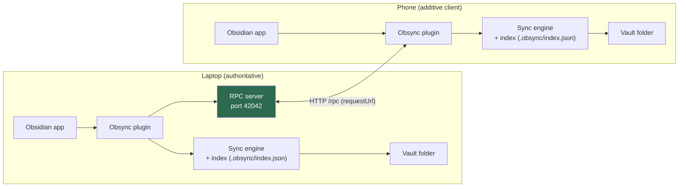
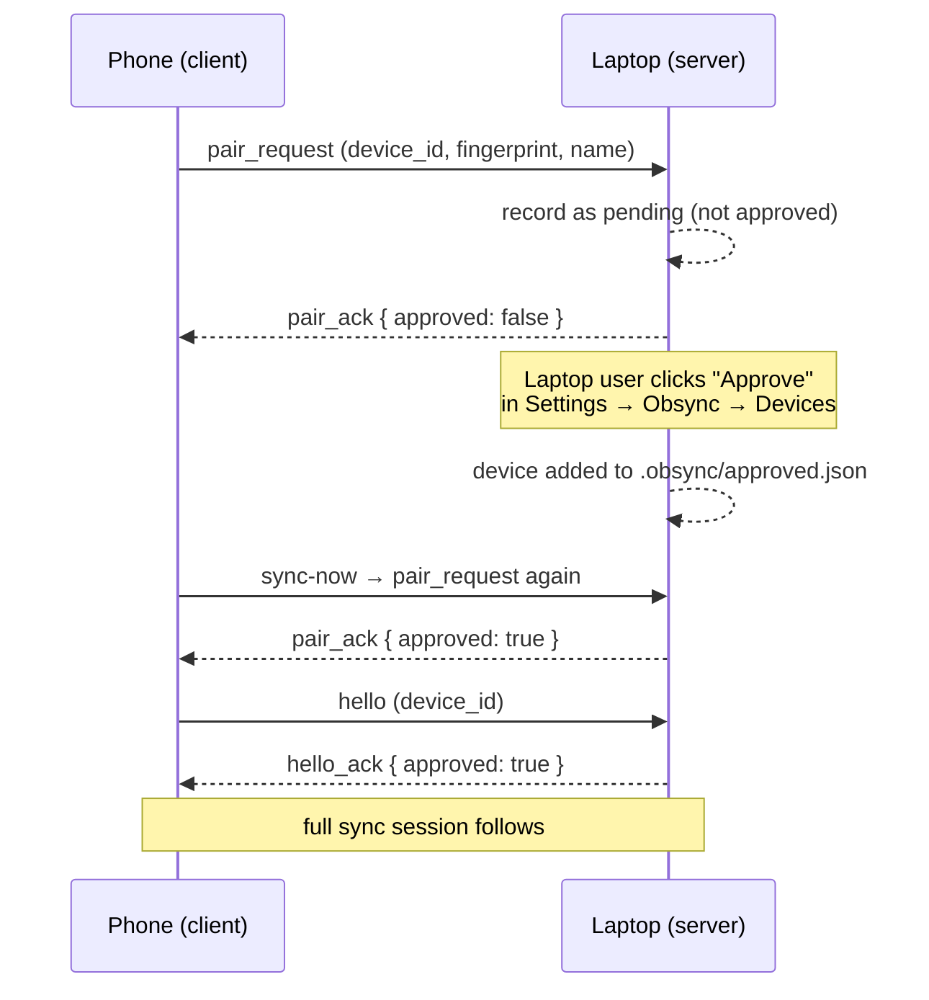
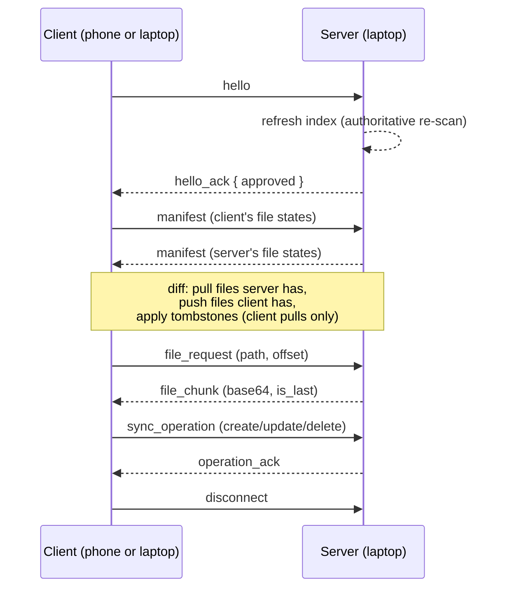
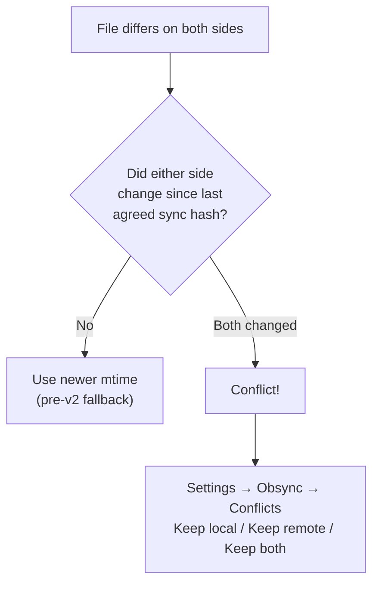

<div align="center">

# Obsync

**Free, local-first P2P sync for your Obsidian vault. No cloud. No account. No subscription.**

Sync your Obsidian vault between your laptop and your phone over your own
network — encrypted, direct, and private. Your notes never touch a third-party
server.


</div>

---

## Why Obsync?

Obsidian Sync costs **$4/month** and sends your vault through Obsidian's cloud.
Obsync is an alternative that keeps your notes on your devices:

- **No cloud, no accounts** — devices talk directly over your LAN.
- **Encrypted P2P transport** — a dedicated sync protocol on your own network.
- **Pairing by fingerprint** — approve each device once; no passwords to share.
- **Conflict detection** — files edited on both sides are flagged, never silently clobbered.
- **Local-first** — your vault stays an ordinary folder on disk. No lock-in; leave anytime.
- **Works on desktop and mobile** — the same plugin runs on both, so a laptop
  pairs with a phone over the hotspot.
- **Near-instant** — vault changes propagate within a few hundred milliseconds
  (the mobile polls every 250 ms; both sides sync ~150 ms after an edit).

## How it works

One device (usually your laptop) runs the **server**: Obsidian → Settings →
Obsync → **Start**. The other device (usually your phone) runs the **client**:
set the server URL (e.g. `http://192.168.1.5:42042`) and the phone takes it
from there.

The laptop is **authoritative for deletions**; the phone is **additive-only**,
so a partially synced phone can never delete files on the server. Every edit
made on either side is detected by re-scanning the vault, and diverged files
are surfaced as conflicts you resolve in the settings tab.

### Architecture



### Pairing a new device



### One sync session



### Conflict resolution



> **Conflict model:** revisions are per-device counters and are *not* a reliable
> "both changed" signal — the real signal is the `synced_hash` column (the
> content hash the last sync agreed on). A conflict is flagged only when **both**
> sides changed since that agreement. See
> [`src/core/conflict.ts`](src/core/conflict.ts).

## Install

1. In Obsidian, open **Settings → Community plugins** and install **Obsync** from the catalog.
2. Enable it.
3. Open **Settings → Obsync** to start the server, pair a device, or configure the server URL.

### First-time walkthrough

1. On the laptop: **Settings → Obsync → Start** (server listens on port 42042).
2. On the phone: **Settings → Obsync**, set the server URL to the laptop's IP
   (e.g. `http://10.174.223.140:42042`), then **Sync now**.
3. The phone's device appears under **Awaiting approval** on the laptop — click **Approve**.
4. Tap **Sync now** again on the phone. Done — from here on it syncs automatically.

> The URL is normalized for you: `10.174.223.140:42042` works, no `http://` needed.
> See [`src/core/transport.ts`](src/core/transport.ts#L4) (`normalizeServerUrl`).

## How sync is triggered

- **On edit** — vault `create`/`modify`/`delete` events trigger a debounced sync
  (~150 ms) on both platforms.
- **On poll** — the phone polls the server every **250 ms** (configurable, min
  100 ms) to pick up remote changes; HTTP is request/response, so there is no
  push channel.
- **On demand** — the ribbon icon / "Sync now" command always forces a session.

Both are gated by a `syncInProgress` guard so sessions never overlap. See
[`main.ts`](main.ts).

## Development

```bash
npm install
npm run build      # tsc typecheck + esbuild bundle → main.js
npm test           # vitest (90 tests: engine, sync, store, scanner, crypto, pairing…)
```

The engine is a TypeScript port of the Rust sync engine in
[chintu79/obsync](https://github.com/chintu79/obsync), with cross-language
conformance tests keeping the two implementations equivalent.

### Project layout

| Path | What it is |
|---|---|
| [`main.ts`](main.ts) | Plugin entry: server/client bootstrap, auto-sync, status bar |
| [`src/core/engine.ts`](src/core/engine.ts) | Port of the Rust sync engine (index, manifest, conflict planning) |
| [`src/core/session.ts`](src/core/session.ts) | The sync session protocol (hello/manifest/pull/push) |
| [`src/core/pairing.ts`](src/core/pairing.ts) | Device approval + pending-request tracking |
| [`src/core/transport.ts`](src/core/transport.ts) | HTTP framing + server + URL normalization |
| [`src/core/store.ts`](src/core/store.ts) | JSON state store (`.obsync/index.json`) |
| [`src/core/conflict.ts`](src/core/conflict.ts) | Divergence detection (the `synced_hash` rule) |
| [`src/ui/settings-tab.ts`](src/ui/settings-tab.ts) | Settings UI: server, URL, auto-sync, devices, conflicts, versions |
| [`docs/device-test.md`](docs/device-test.md) | End-to-end checklist for testing on real hardware |

### Release

Tag a version (no `v` prefix — Obsidian requires the tag to match
`manifest.json` exactly):

```bash
git tag 1.0.0
git push origin 1.0.0
```

The [release workflow](.github/workflows/release.yml) builds `main.js` and
attaches `main.js` + `manifest.json` + `styles.css` to a GitHub release.

## Related

- [Obsync core (Rust)](https://github.com/chintu79/obsync) — the sync engine,
  `httpd` dashboard, and Android app this plugin's engine is ported from.
- [Device test checklist](docs/device-test.md) — verify pairing, both-way sync,
  conflicts, and restart persistence on real hardware.

## License

Licensed under either of

- Apache License, Version 2.0 ([LICENSE-APACHE](LICENSE-APACHE))
- MIT license ([LICENSE](LICENSE))

at your option.

© 2026 Obsync contributors.
